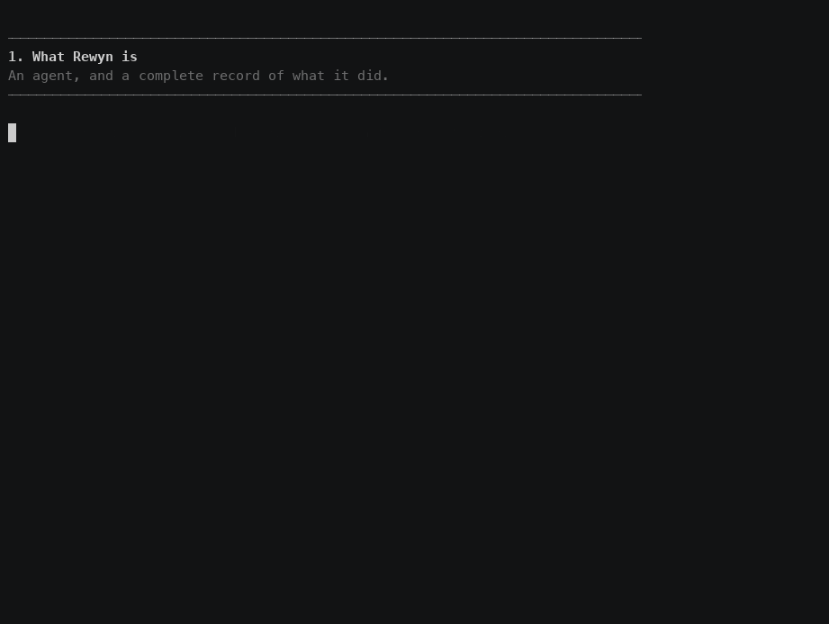

# Rewyn

**Build. Run. Replay. Improve AI.**

Rewyn is a universal, open, modular AI engineering SDK. It provides the
primitives for building modern agents (models, tools, context, memory, RAG,
MCP, skills, loops, graphs, subagents, handoffs, state, checkpoints,
guardrails, human-in-the-loop) and the infrastructure for understanding,
replaying, evaluating and continuously improving their behaviour.

```python
from rewyn import Agent

agent = Agent(model="openai:gpt-5")
result = agent.run("Research the latest electric vehicle market")
```

Every primitive emits structured execution events. Every run is recorded
locally under `.rewyn/`, can be inspected, exported, replayed, diffed and
turned into a regression test.

```python
from rewyn.evaluation.dataset import Dataset
from rewyn.evaluation.metrics import exact_match
from rewyn.evaluation.regression import run_regression
from rewyn.replay.replay import replay

# Reproduce the run exactly, with no provider call.
replay(result.run_id)

# A production run becomes a regression test.
dataset = Dataset(name="critical")
dataset.add_run(result.run_id)
report = run_regression(dataset, agent, evaluators=[exact_match()])
print(report.render())
```

## See it work



```bash
uv run python -m demo
```

A minute, offline, no API key. A support agent that works; the same desk
built full stack with retrieval, memory, MCP, a subagent, a graph and a
hostile customer email that cannot override policy; the same agent giving a
different answer the next day; and the diff, replay and release gate that
catch it. See [demo/](demo/).

## Install

```bash
pip install rewyn                # core, provider agnostic
pip install "rewyn[openai]"      # OpenAI adapter
pip install "rewyn[anthropic]"   # Anthropic adapter
pip install "rewyn[google]"      # Google Gemini adapter
pip install "rewyn[mcp]"         # Model Context Protocol client/server
pip install "rewyn[redis]"       # shared memory and checkpoints
pip install "rewyn[s3]"          # S3-compatible object storage
pip install "rewyn[search]"      # Elasticsearch / OpenSearch retrieval
pip install "rewyn[ui]"          # the local console (rewyn ui)
pip install "rewyn[all]"         # everything
```

Rewyn is local-first: no account, no cloud, no Rewyn API key.

## CLI

```
rewyn init | runs | inspect | replay | diff | eval | test | datasets
        | manifest | drift | export | import | doctor | skills | mcp | agents
        | ui | login | logout | sync
```

## Console

```bash
pip install "rewyn[ui]"
rewyn ui                          # http://127.0.0.1:4400
```

An execution debugger for your own runs: the timeline of everything an agent
did, the execution graph, and a context inspector that shows which item came
from where, at which version, and how much of the budget it cost. No account
and no cloud -- it reads the `.rewyn/` you already have. The cloud console
serves the same screens over a team's runs. See [docs/ui.md](docs/ui.md).

## Cloud (optional)

Rewyn stays fully usable with no account. When a team wants shared runs,
datasets and evaluations, `rewyn-cloud` is a FastAPI service in this
repository that the SDK syncs to:

```bash
uv run rewyn-cloud create-project acme   # prints an API key once
uv run rewyn-cloud serve

uv run rewyn login --endpoint http://127.0.0.1:8000 --key rw_...
uv run rewyn sync
```

Uploads retry, buffer locally when the service is unreachable, and never
raise into your application. See [cloud/README.md](cloud/README.md).

## Development

```bash
make install   # uv sync with all extras
make check     # ruff + mypy --strict + pytest
```

## Documentation

[docs/](docs/) has a page per subsystem, each with a concept, a minimal
example, a production example, an API pointer and the failure modes. Start
with [getting started](docs/getting-started.md).

The golden demo is one application that uses every subsystem and then
replays, diffs, evaluates and gates itself, offline:

```bash
uv run python -m examples.enterprise_research_agent
```

Rewyn also works alongside what you already run: Redis, PostgreSQL with
pgvector, S3, Elasticsearch, OpenTelemetry, other agent frameworks, and
other agents over an agent-to-agent interface. See
[integrations](docs/integrations.md).

See [`docs/`](docs/) for the subsystem guides, and
[`CONTRIBUTING.md`](CONTRIBUTING.md) if you would like to help.

## License

Apache-2.0.
